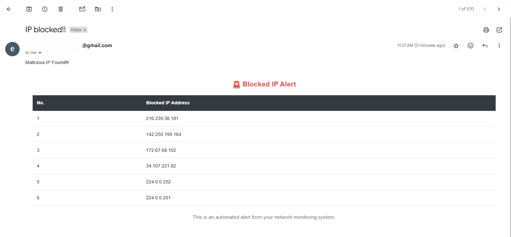
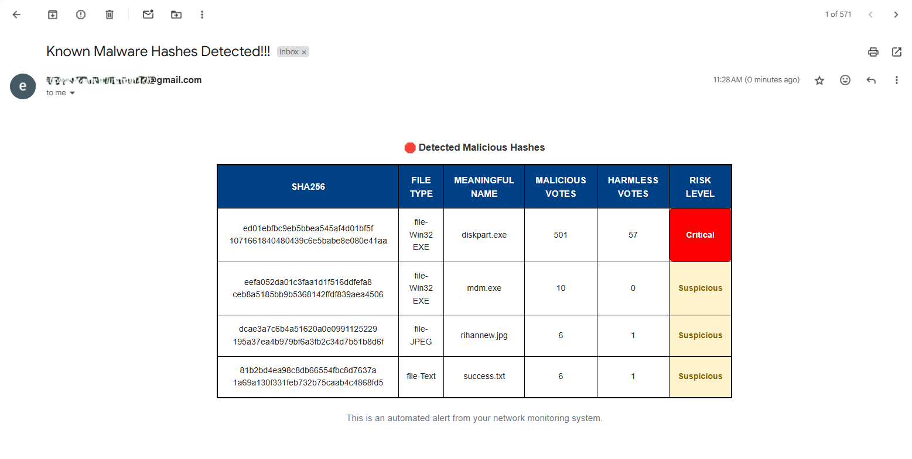

<!--# Automated Network Threat Detection and Response

## Introduction

In today's rapidly evolving cyber threat landscape, timely and automated responses are critical for effective network security. This project integrates several open-source tools into a solid, automated threat detection and response system. It leverages Suricata and Zeek to monitor and log network traffic, with logs being ingested by an ELK (Elasticsearch, Logstash, Kibana) stack for centralized analysis. Using n8n as a workflow automation platform, the system extracts public IP addresses from the ELK logs, cross-references them with external threat intelligence services (VirusTotal and AbuseIPDB), and if an IP is deemed malicious automatically enforces a network block via iptables/Firewall.

This end-to-end automation minimizes manual intervention, reduces response times and enhances overall network resilience against cyber-attacks.

## Problem Statement

Organizations face a continuously evolving threat landscape where traditional, manual methods of threat detection and response are increasingly insufficient. Manual analysis of network traffic logs and the subsequent response to detected threats are time-consuming and prone to human error, leading to delayed mitigation and a higher risk of successful cyber-attacks.

While advanced SOAR (Security Orchestration, Automation, and Response) tools exist to automate these processes, their high costs and complexity make them inaccessible for many small businesses. Small and medium-sized enterprises (SMEs) require a cost-effective solution that provides similar benefits without the prohibitive expense.

## Objectives

- **Real-time Threat Detection**: Continuously monitor network traffic for suspicious activity.
- **Automated Threat Intelligence Lookup**: Cross-reference identified threats with external databases.
- **Alerting & Notification**: Notify the security team of detected threats.
- **Automated Response**: Block malicious IPs in real-time.
- **Cost-Effective SOAR Solution for SMEs**: Provide an affordable alternative to expensive commercial solutions.

## Methodology

1. **Traffic Monitoring**: Suricata and Zeek are deployed to capture and analyze network traffic.
2. **Log Aggregation**: ELK stack collects and indexes logs for centralized analysis.
3. **Data Extraction & Analysis**: Suspicious IPs are extracted from logs and analyzed against threat intelligence sources.
4. **Automated Response**: Malicious IPs are automatically blocked via `ufw`.
5. **Logging & Reporting**: Alerts and responses are documented for further analysis.

## Lab Setup

- **Operating System**: Ubuntu 24.04.1
- **Intrusion Detection Systems (IDS)**: Suricata and Zeek
- **Security Information and Event Management (SIEM)**: ELK (Elasticsearch, Logstash, Kibana)
- **Automation Platform**: n8n
- **Threat Intelligence APIs**: VirusTotal and AbuseIPDB
- **Firewall**: UFW (built-in Ubuntu firewall)

## Outcomes

- **Cost-Effective Solution**: Reduces the need for expensive commercial SOAR tools.
- **Near Real-Time Monitoring and Analysis**: Enables proactive network defense.
- **Automated Threat Intelligence Integration**: Enhances detection capabilities.
- **Proactive Response**: Mitigates threats before they cause damage.
- **Reduced Operational Burden**: Minimizes manual intervention.
- **Enhanced Network Security**: Strengthens overall cybersecurity posture.

## Installation & Deployment

1. **Install Suricata & Zeek**
   ```bash
   sudo apt update && sudo apt install -y suricata zeek
   ```

2. **Install ELK Stack**
   Follow the official [ELK installation guide](https://www.elastic.co/guide/en/elastic-stack/current/index.html).

3. **Set Up n8n**
   ```bash
   npm install -g n8n
   ```

4. **Configure Threat Intelligence APIs**
   - Register for API keys from [VirusTotal](https://www.virustotal.com/) and [AbuseIPDB](https://www.abuseipdb.com/).
   - Configure n8n workflows to fetch threat intelligence data.

5. **Deploy Firewall Rules**
   ```bash
   sudo ufw enable
   ```

## Contributing

Contributions are welcome! If you have improvements or new features to add, feel free to submit a pull request.

## License

This project is licensed under the MIT License - see the [LICENSE](LICENSE) file for details.

## Contact

For queries and suggestions, feel free to reach out.

---

-->

# 🛡️ Automated Network Threat Detection & Response (ANTD&R)


## ⚙️ Overview

**Automated Network Threat Detection & Response (ANTD&R)** is an open-source, workflow-driven threat detection and response system powered by [n8n](https://n8n.io/). It integrates threat intelligence services with Elasticsearch logs to automate the detection of malicious IPs and suspicious file hashes—and responds in real-time with alerts and firewall rules.

---

## 🧰 Tech Stack

- **n8n** – Workflow automation
- **Elasticsearch** – Log storage and querying
- **Zeek** & **Suricata** – Network security monitoring
- **VirusTotal API** – File and IP reputation checks
- **AbuseIPDB** – IP abuse verification
- **UFW** – IP blocking
- **Gmail** – Email notifications

---

## 🚀 Features

- ⏱️ **Cron-based execution** for scheduled threat hunting  
- 📦 **Log ingestion from Elasticsearch**:  
  - Suspicious file hashes  
  - Public IP addresses  
- 🌐 **Threat intelligence lookups** using:
  - [VirusTotal](https://virustotal.com)  
  - [AbuseIPDB](https://abuseipdb.com)  
- 🔐 **Automated remediation**:
  - IP blocking via UFW
  - Email alerts with HTML-formatted reports
- 🧠 **Risk classification** of file hashes:
  - Low Risk
  - Suspicious
  - High Risk
  - Critical

---

## 📬 Email Alerts

When threats are detected:
- ⚠️ An email is sent to the SOC team with full threat context.
- 📄 Includes categorized risk reports and IP/hash details in a readable HTML format.

---

## 📸 Workflow Snapshot

> Here’s what the full `n8n` workflow looks like:


---

## 📬 Email Alerts

When threats are detected:

- ⚠️ An email is sent to the SOC team for further Threat Hunting.
- 📄 Emails are customized for each type of alert:
  - **IP Alerts** – contain reputation data and auto-block status
  - **File Hash Alerts** – include risk classification and lookup results

### 📨 IP Alert Email Example



---

### 📨 File Hash Alert Email Example




---

## 📁 Project Structure


### Acknowledgments

Special thanks to the developers of Suricata, Zeek, ELK Stack, n8n, and the cybersecurity community for their contributions to open-source security solutions.

